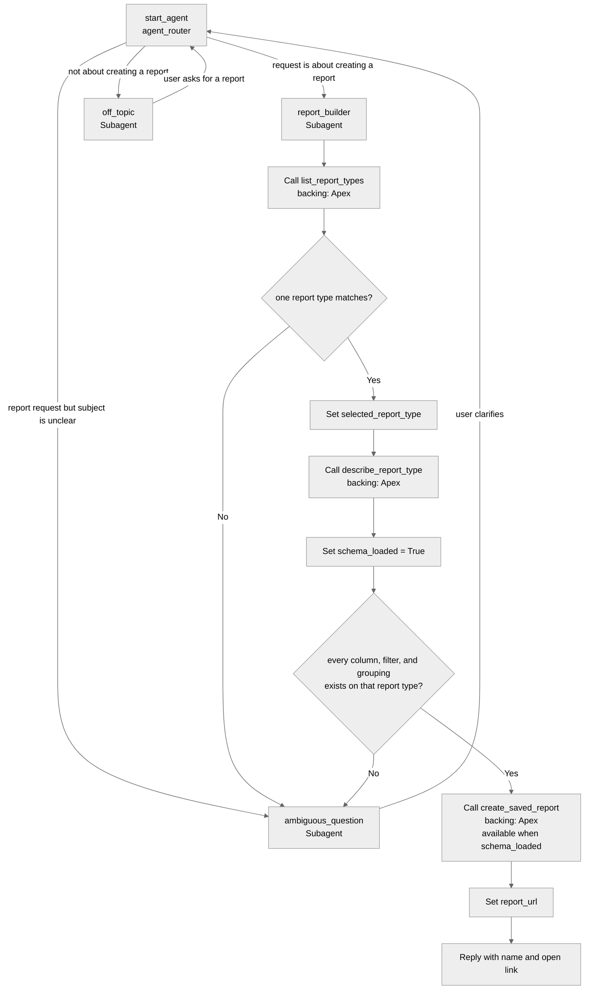

# Agent Spec: Report_Creation_Agent

## Purpose & Scope

Coworkers delegate report requests to this agent. They describe the report in everyday language ("open opportunities by stage for this quarter, grouped by owner"). The agent saves a real Salesforce report and replies with the name and a link the requester can open.

It creates one saved report per request. It does not paste report rows back into the chat, build dashboards, edit or delete existing reports, or build joined reports, historical trending, charts, cross filters, buckets, or custom summary formulas.

## Behavioral Intent

- The agent only uses report types and column names returned by the org. It never invents a column or report type.
- A request that names the subject clearly (which records, and how to break them down or filter them) is saved in the same turn. A delegated request should finish without a confirmation loop.
- If the subject of the report cannot be matched to one report type, or a filter/grouping cannot be matched to a real column, the agent asks one clarifying question and does not save anything yet.
- Before saving, the agent restates the report in one sentence: name, report type, columns, filters, and groupings. That sentence is the reply, plus the link, after a successful save.
- The report is saved in the requesting user's private reports, so the person who asked can open it. A shared folder is out of scope until asked for.
- Failures are explained in plain language (unknown column, no access, name already used) with what to change. Raw API payloads are not shown.
- Off-topic requests are redirected back to report creation. There is no handoff to a human channel.
- Nothing about the conversation is stored outside the agent session. The durable result is the saved report.

## Subagent Map

## Variables

- `selected_report_type` (mutable string = "") — Report type API name chosen from `list_report_types`. Set by: `report_builder` after a single match. Read by: `describe_report_type` and `create_saved_report`.
- `schema_loaded` (mutable boolean = False) — True only after `describe_report_type` succeeds for `selected_report_type`. Set by: `report_builder`. Read by: gating on `create_saved_report`.
- `report_url` (mutable string = "") — Lightning link of the saved report. Set by: `create_saved_report`. Read by: the closing reply.
- `last_error` (mutable string = "") — Plain-language failure from the last action, if any. Set by: any action output. Read by: the reply when a save does not happen.

## Actions & Backing Logic

No existing invocable Apex, autolaunched Flow, or prompt template in this project creates reports. A scan of the FY27-AF-Builds workspace also found no reusable report-creation action. Every action below is **NEEDS STUB**.

Backing calls the Reports and Dashboards REST API as the requesting user (`POST /services/data/v66.0/analytics/reports`, plus the report-type list and describe resources). The same-org callout uses that user's session. If the session is not available in the agent action, the action returns an error and does not save a report as someone else. A Remote Site Setting for the org's My Domain is required for the callout.

### list_report_types (report_builder subagent)

- **Target:** `apex://ListReportTypesAction`
- **Backing Status:** NEEDS STUB

#### Inputs

| Name | Type | Required | Source |
|------|------|----------|--------|
| search_term | string | Yes | Words from the user's request (object or report subject) |

#### Outputs

| Name | Type | Visible to User? | Source | Notes |
|------|------|-------------------|--------|-------|
| matches_json | string | Yes | Analytics report-type list | JSON array, max 20 items: `label`, `type`, `description` |
| error_message | string | Yes | Computed | Empty on success |

#### Stubbing Requirement

- Apex class `ListReportTypesAction` with an invocable request/result wrapper.
- `GET /services/data/v66.0/analytics/report-types`, filter by the search term against label and type, cap at 20.
- Return only report types the running user can access. Do not return column details here.

### describe_report_type (report_builder subagent)

- **Target:** `apex://DescribeReportTypeAction`
- **Backing Status:** NEEDS STUB

#### Inputs

| Name | Type | Required | Source |
|------|------|----------|--------|
| report_type | string | Yes | `selected_report_type` |

#### Outputs

| Name | Type | Visible to User? | Source | Notes |
|------|------|-------------------|--------|-------|
| columns_json | string | Yes | Analytics report-type describe | JSON array: `apiName`, `label`, `dataType`, `filterable`, `groupable`. Cap at 200 columns and set `truncated` when cut off. |
| truncated | boolean | Yes | Computed | True when the column list was capped |
| error_message | string | Yes | Computed | Empty on success |

#### Stubbing Requirement

- Apex class `DescribeReportTypeAction`.
- `GET /services/data/v66.0/analytics/report-types/{reportType}`.
- Map the describe payload down to the column fields above so the agent can bind filters and groupings to real API names.

### create_saved_report (report_builder subagent)

- **Target:** `apex://CreateSavedReportAction`
- **Backing Status:** NEEDS STUB

#### Inputs

| Name | Type | Required | Source |
|------|------|----------|--------|
| report_name | string | Yes | Short name derived from the request |
| report_type | string | Yes | `selected_report_type` |
| report_format | string | Yes | `TABULAR` or `SUMMARY`. `MATRIX` only when the user asks for row and column groupings. |
| detail_columns_json | string | Yes | JSON array of column API names from `columns_json` |
| groupings_down_json | string | No | JSON array of groupable column API names. Required when format is `SUMMARY`. |
| filters_json | string | No | JSON array of `{ "column", "operator", "value" }` using operators the describe metadata allows |
| scope | string | No | Defaults to `organization` |

#### Outputs

| Name | Type | Visible to User? | Source | Notes |
|------|------|-------------------|--------|-------|
| success | boolean | Yes | Computed | False when the API rejects the report |
| report_id | string | Yes | Analytics API | Salesforce report Id |
| report_name | string | Yes | Analytics API | Name actually saved |
| report_url | string | Yes | Computed | `{MyDomain}/lightning/r/Report/{reportId}/view` |
| error_message | string | Yes | Computed | Empty on success. Plain language on failure. |

#### Stubbing Requirement

- Apex class `CreateSavedReportAction`.
- `POST /services/data/v66.0/analytics/reports` with a `reportMetadata` body. Omit `folderId` so the report lands in the running user's private reports.
- Reject the call unless every column and grouping was present in the describe result for that report type. Do not send names the describe step did not return.
- On a duplicate-name error, retry once with the date appended to the name, then return the new name.
- Supported in v1: tabular and summary reports, standard filters, one or more row groupings. Not supported: charts, joined reports, cross filters, historical trending, buckets, formula fields. Return a clear error if the request needs one of those.

## Gating Logic

- `create_saved_report` visibility: `available when @variables.schema_loaded == True` — A report is saved only after the chosen report type has been described, so column names come from the org.
- `list_report_types` and `describe_report_type` stay available for the whole `report_builder` turn — The agent may search and describe again if the first match is wrong.
- No gating on the guardrail subagents. They have no actions.

## Architecture Pattern

Hub-and-spoke with a single domain subagent. `agent_router` is the entry point and sends report requests to `report_builder`, unclear report requests to `ambiguous_question`, and everything else to `off_topic`. Both guardrails return to the router once the user responds. `report_builder` does not hand off to another domain; it searches, describes, then saves.

## Agent Configuration

- **developer_name:** `Report_Creation_Agent`
- **agent_label:** `Report Creation Agent`
- **agent_type:** `AgentforceEmployeeAgent` — coworkers inside the company delegate to it. It is not on a customer messaging channel.
- **default_agent_user:** N/A — employee agent. The config block must not set `default_agent_user`, a messaging connection, or MessagingSession linked variables.
- **welcome message:** "Tell me the report you want. I'll save it and send you a link to open it."
- **tone:** Direct and concise, like a coworker who builds the report and gets out of the way.
- **permissions verified:** Yes for Andy Kraft (`storm.095611652f06f1@salesforce.com`, System Administrator). He already had Access Agentforce Default Agent. `Report_Creation_Agent_User` is assigned and includes agent access. Target org is the local alias `Universal`.
- **Backing scan:** This repo is empty. No `@InvocableMethod`, autolaunched flow, or prompt template exists to reuse.

## Decisions to confirm

1. Save into the requester's private reports, rather than a shared folder.
2. Save immediately when the request is specific. Ask one question only when the report type or a column cannot be resolved.
3. v1 is tabular and summary reports on any report type the user can already access. No object blocklist, no dashboards, no edits to existing reports.
